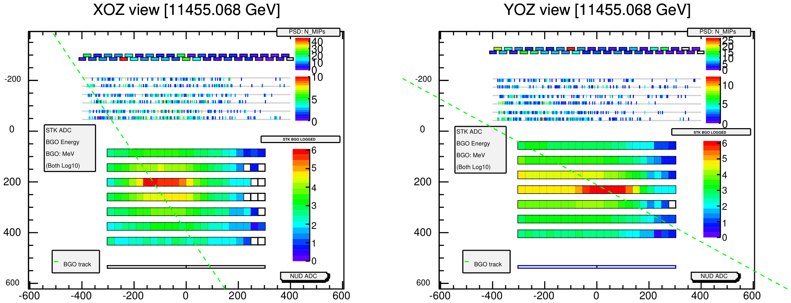
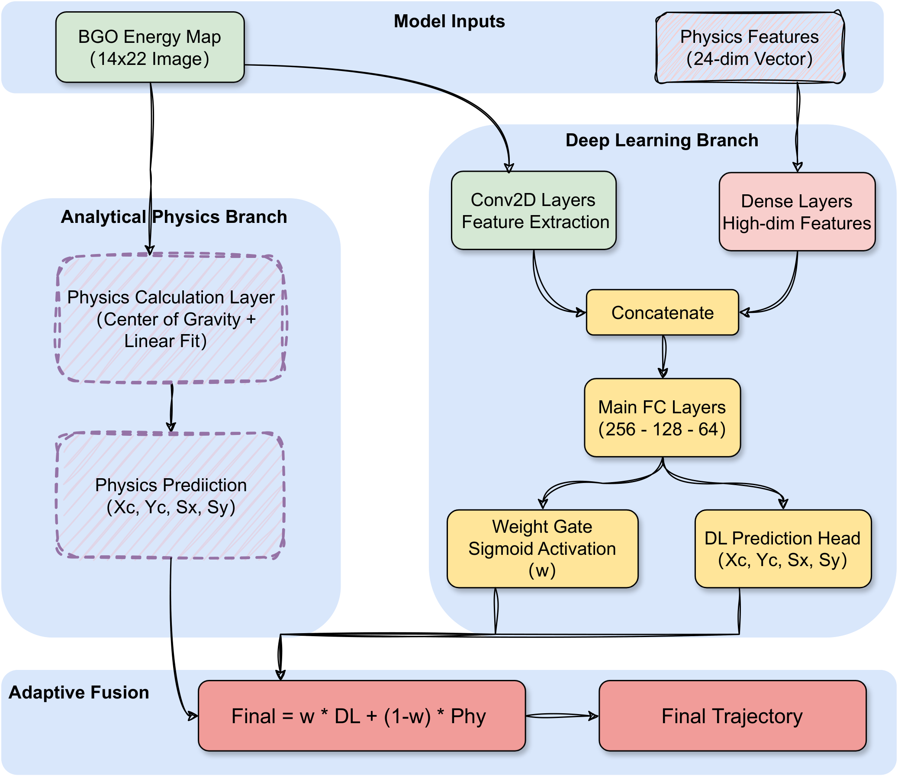
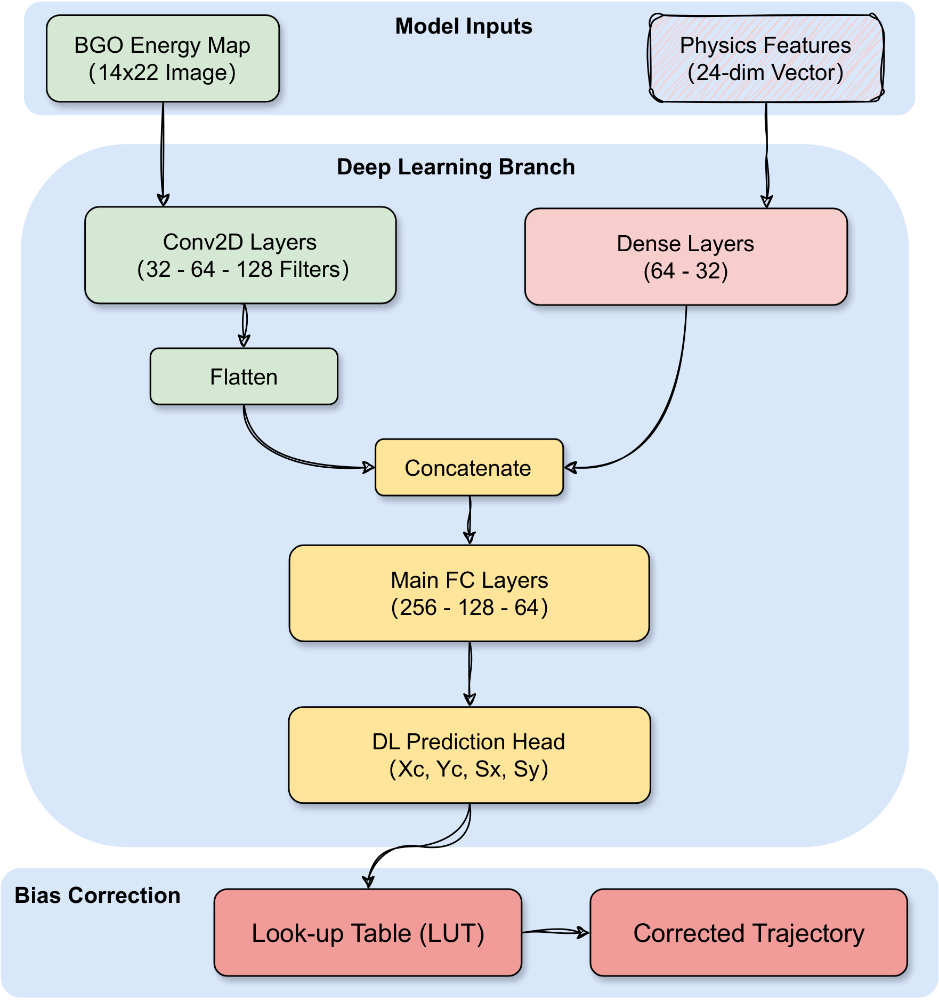

# 🌌 DAMPE Full-Angle Particle Trajectory Reconstruction

> **A Physics-Guided Deep Learning Strategy for Cosmic Ray Electron Tracking**

[](https://opensource.org/licenses/MIT)
[](https://www.python.org/downloads/)
[](https://www.tensorflow.org/)

## 📖 Introduction

Welcome to the official repository for the paper **"Full-angle cosmic ray electron trajectory reconstruction for the DAMPE BGO calorimeter using a physics-guided deep learning strategy"**.

The **Dark Matter Particle Explorer (DAMPE)** is a powerful space telescope hunting for dark matter signatures. However, like many telescopes, it has a "blind spot": consistent tracking algorithms fail when particles enter at large angles (exceeding 60°), bypassing the Tracker (STK) and Plastic Scintillator (PSD).

This project solves this challenge by enabling **trajectory reconstruction using solely the BGO Calorimeter**, effectively **expanding DAMPE's field of view by 5x!** 🚀

<p align="center">
  
  <br>
  <em>Figure 1: Traditional methods fail when particles miss the STK (Green dashed line). Our method recovers these tracks using only BGO data.</em>
</p>

---

## 💡 Key Innovations

Our solution uses a **Hierarchical "Divide-and-Conquer" Framework** that adapts to the physics of the particle shower:

### 1. 🚦 Automatic Event Classification (SVM)

We don't treat all events the same. An SVM classifier acts as a reliable router (98.4% accuracy), instantly categorizing events into:

- **Standard Incidence ($0^{\circ}$--$60^{\circ}$)**
- **Large Incidence ($60^{\circ}$--$90^{\circ}$)**

### 2. 🧠 Standard Angle: Physics-Guided Hybrid Neural Network (PGHNN)

For standard angles, we don't throw away known physics. We use a **PGHNN** that fuses:

- **Visual Stream (CNN)**: Learns from raw energy maps.
- **Physics Stream (Dense)**: Incorporates 24 manually derived physical features (moments, asymmetry, etc.).
- **Dynamic Weighting**: The network learns *when* to trust traditional fitting and *when* to trust the neural network.

<p align="center">
  
</p>

### 3. 🔮 Large Angle: Deep Learning Recovery

For large angles (where showers leak out of the detector), traditional formulas break down. Here, we rely on a specialized Deep Learning model trained with **Curriculum Learning** to infer the incident direction even from partial, truncated showers.

<p align="center">
  
</p>

---

## 📊 Performance at a Glance

| Metric                             | Standard Angle ($0^{\circ}-60^{\circ}$) | Large Angle ($60^{\circ}-90^{\circ}$) |
| :--------------------------------- | :---------------------------------------: | :-------------------------------------: |
| **Method**                   |               Hybrid PGHNN               |              Deep Learning              |
| **Angular Resolution** (68%) |             **1.32°**             |            **1.91°**            |
| **Efficiency**               |                   ~100%                   |                  ~100%                  |

This approach allows DAMPE to analyze **all** incoming electrons, regardless of their angle, significantly boosting the statistics for dark matter searches!

---

## 📂 Repository Structure

- **`tools/standard.py`**: Implementation of the **PGHNN** for standard angle reconstruction.
- **`tools/large_angle.py`**: Implementation of the deep learning model for large angle reconstruction.
- **`paper.pdf`**: The manuscript.

## 🎓 Citation

If you find this work useful for your research, please consider citing our paper:

```bibtex
@article{DAMPE_FullAngle_2025,
  title={Full-angle cosmic ray electron trajectory reconstruction for the DAMPE BGO calorimeter using a physics-guided deep learning strategy},
  author={Xun Zhu and PengXiong Ma and JianHua Guo},
  journal={Nuclear Physics B (Submitted)},
  year={2025}
}
```
